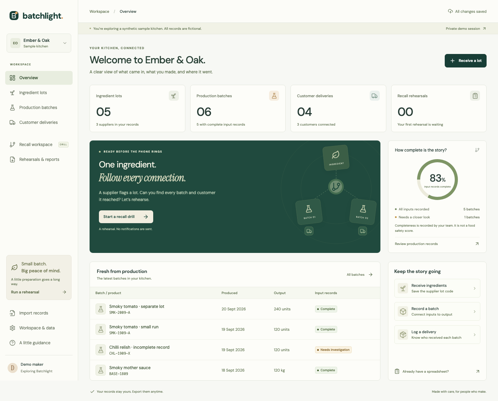
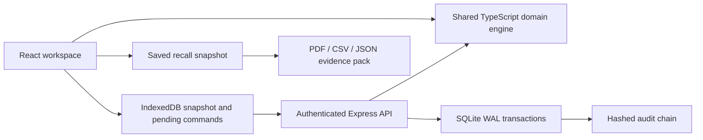

<div align="center">

# Batchlight

### A fire drill for your next food recall.

**One missing ingredient record. A hundred and twenty uncertain jars. What happens when the evidence turns up?**

[Try the browser demo](https://shi1720.github.io/HACK47/) · [Run the full application](#run-the-full-application) · [Watch / record the demo](submission/DEMO-SCRIPT.md) · [Submission package](submission/README.md)

Built for **HACK47: OFFGRID** by **Shivam Gupta**, with substantial AI assistance.

</div>



## The problem

A small food maker can have supplier labels, production sheets and delivery notes without a reliable connection between them. When a supplier flags an ingredient, a missing record creates a difficult question: did this batch use that lot, or is the evidence simply incomplete?

Batchlight connects ingredient lots to production batches, intermediate batches and customer deliveries. A recall rehearsal shows three distinct outcomes:

- **Recorded connection:** a path exists through the entered records.
- **Needs investigation:** incomplete inputs leave the connection unresolved. That uncertainty follows downstream batches and deliveries.
- **No recorded connection:** the entered records contain no path. This does **not** establish food safety.

The distinctive loop is **evidence repair**. Add a recovered ingredient reference to an incomplete batch. Recalculate the live trace. Open the earlier saved report and see that it still preserves the uncertainty that existed at the time.

## Try it in three minutes

The [public demo](https://shi1720.github.io/HACK47/) runs locally in your browser, with fictional data and no signup. Records persist on that device. It supports record entry, imports, tracing, evidence correction, saved reports, CSV/JSON/PDF exports, and offline use after the first successful load. **It does not host account authentication or synchronize across devices.** The full application below provides those features.

1. Click **Explore the live demo**, then **Start a recall drill**.
2. Trace `PAP-2409`. The synthetic fixture connects **480 finished jars**, including **300 shipped** and **180 on hand**, through an intermediate mother sauce.
3. Open **Batch scope**. `CHL-1909-X` has **120 units requiring investigation**. A separate 240-unit batch has **no recorded connection**.
4. **Save this rehearsal** and **Save snapshot**.
5. Return to the trace. Inspect `CHL-1909-X`, choose **Resolve record gap**, record `0.5 kg` of `PAP-2410`, cite the recovered synthetic production sheet, and confirm the evidence review.
6. Open **Evidence changes** to compare the original and current classifications, with the recovered reference alongside. The original **Rehearsals & reports** snapshot stays unchanged. Download its evidence pack.

The fixture does not represent customers, actual incidents, measured savings, or food-safety conclusions.

## Run the full application

Requires **Node.js 22.12+** and npm. No AI key, cloud database, paid account or email provider is needed.

```bash
git clone https://github.com/shi1720/HACK47.git
cd HACK47
npm ci
npm run dev
```

Open **http://localhost:5180**. Create a private account or open an isolated server demo. Development uses an API on loopback port 3087 and a Vite proxy. SQLite persists in `data/batchlight.sqlite`, which is ignored by Git.

For the compiled application with its offline service worker, stop the development server and use:

```bash
npm run local
```

This serves the built frontend and real API on localhost for evaluation. Production hosting uses the included Dockerfile, an HTTPS reverse proxy, a persistent volume and the correct `APP_ORIGIN`. See [operations and backup/restore](docs/OPERATIONS.md). Docker configuration is supplied; container execution requires a running Docker engine.

**Account recovery:** save the one-time recovery code shown at signup. Recovery rotates that code and revokes existing sessions. Account emails are not verified, and the application does not send recovery emails.

## What is implemented

| Workflow | Behavior |
| --- | --- |
| Receiving | Supplier lots, quantities, dates, original codes and source references |
| Production | Multiple ingredient inputs and intermediate batches, date and allocation validation |
| Distribution | Batch-specific deliveries with customer contacts and source records |
| Trace analysis | Forward graph traversal, provenance paths and downstream uncertainty propagation |
| Evidence repair | Append reviewed missing inputs, preserve original evidence, recalculate live scope |
| Evidence comparison | Compare live batch classifications and sources with the latest saved rehearsal for the same lot |
| Saved rehearsals | Dated record snapshots with validated results; later corrections preserve historical reports |
| Evidence pack | Actual PDF, sortable CSV, JSON snapshot and editable customer contact drafts |
| Imports | Atomic related CSV/JSON import, friendly code references, row errors, no partial writes |
| Accounts | Scrypt passwords, opaque hashed sessions, CSRF/origin checks, rate limits and tenant isolation |
| Offline work | IndexedDB workspace/outbox, service-worker shell, idempotent server writes, visible stock/revision conflicts |
| Competing tabs | One tab owns the device writer lock; another can read and export without overwriting pending work |
| Portability | Full workspace JSON export and documented consistent SQLite backup/restore |

This release records **source references**, not uploaded source documents. It does not OCR labels, infer ingredients from a recipe, model contamination or cross-contact, send notifications, collect payments, or certify regulatory compliance. Ingredient quantities are in their source units. Stock allocation is conserved; physical cooking yield is not a cross-unit mass-balance calculation.

## Architecture



The browser and server share the same strict domain validation. The server remains authoritative for accepted account records. A command ID prevents duplicate writes, and a revision check prevents a stale transaction from overwriting another. Offline reports retain their original scope; if another device changes the base records, synchronization pauses for review instead of quietly recomputing the report.

Quantities use integer thousandths internally. The engine rejects oversubscription, invalid dates, duplicate codes/IDs, missing sources, cycles and overly deep ancestry. The graph is capped at 128 transformation levels to bound provenance-path memory. There is no paid inference on the core path.

Audit hashes help compare a history with a trusted original. They do not independently authenticate entered evidence or stop a database administrator from rewriting an entire chain.

## Verification

```bash
npm run check
npm test
npm run build
npx playwright install chromium
npm run test:e2e
npm audit
```

The browser suite runs an isolated, production-built app against a disposable test database. It exercises the actual UI, exported PDF bytes, first offline reload, recovery-code rotation, independent account isolation, competing devices, evidence repair, responsive layouts and accessibility checks. See [test evidence](docs/TESTING.md) for the final measured results and their limits.

Use `npx tsx scripts/benchmark.ts` for the reproducible synthetic graph benchmark. Performance measurements describe this fixture and machine, not a universal speed guarantee.

## Commercial direction

The first proposed buyer is a small sauce producer supplying retailers. Test a **$29/month hosted plan** with free local rehearsal and no charge during an actual recall. This is a pricing hypothesis, not a live paid plan or validated willingness to pay.

Lot tracking and recall drills already exist. Stocksmith, FoodDocs, LotThread and Lotpath are documented competitors. Batchlight focuses on explicit uncertainty, evidence repair and reliable offline capture. The first next step is five observed producer rehearsals and a paid pilot offer, rather than claiming product-market fit. [Business model and customer-validation plan](docs/BUSINESS.md) · [Research sources](docs/SOURCES.md)

## Submission materials

- [Devpost copy](submission/devpost.md)
- [Word-for-word narration and shot list](submission/DEMO-SCRIPT.md)
- [Editable pitch deck](output/presentation/batchlight-pitch.pptx)
- [One-page PDF brief](output/pdf/batchlight-one-pager.pdf)
- [Rubric evidence and honest limitations](submission/JUDGING-EVIDENCE.md)
- [Final submission checklist](submission/SUBMISSION-CHECKLIST.md)
- [Technology and AI disclosures](docs/THIRD-PARTY.md)

**Attribution:** Shivam Gupta is the project creator and product owner. He set the problem-selection criteria, commercial priorities, quality bar and project direction. Research, design, implementation, testing and submission writing used substantial AI assistance. No interviews, customer traction, revenue, or manual coding contributions have been invented.

Created during the OFFGRID build period in September 2026. MIT licensed. The supplied code and synthetic fixture are new work for this project; disclosed open-source libraries provide the underlying infrastructure.
